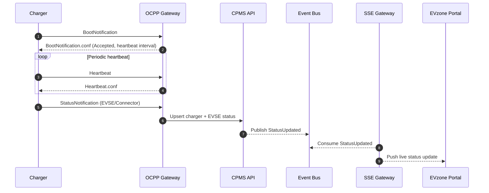
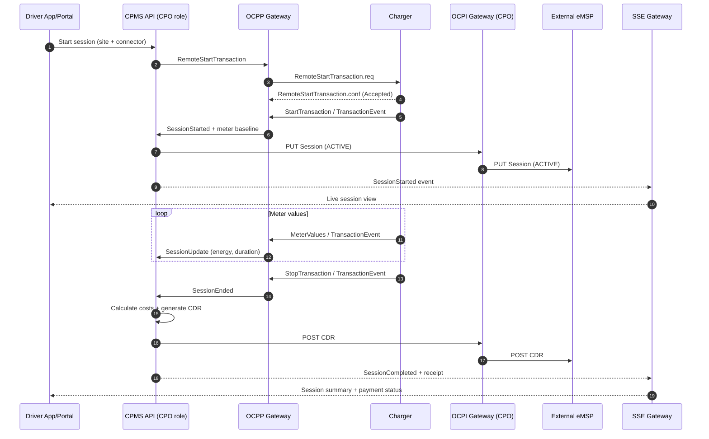
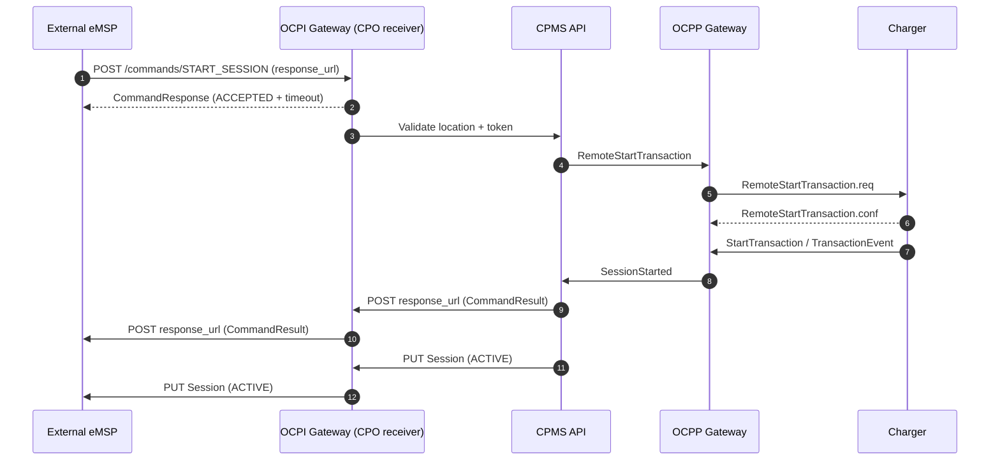
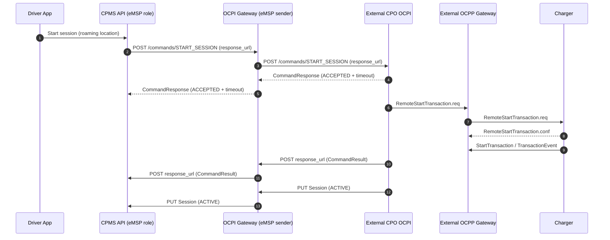
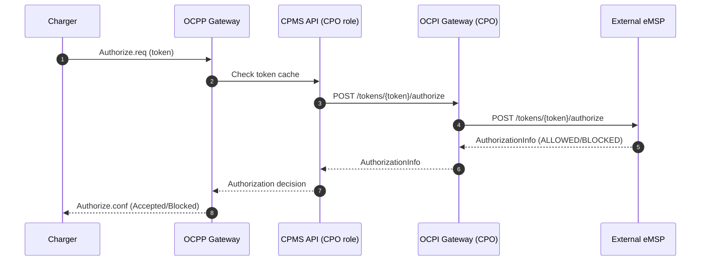
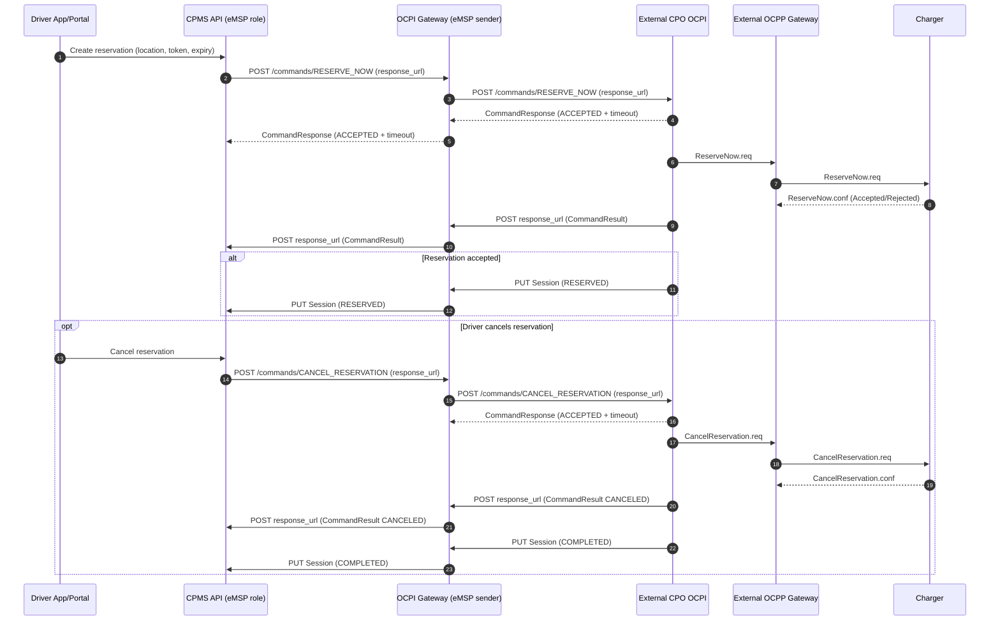
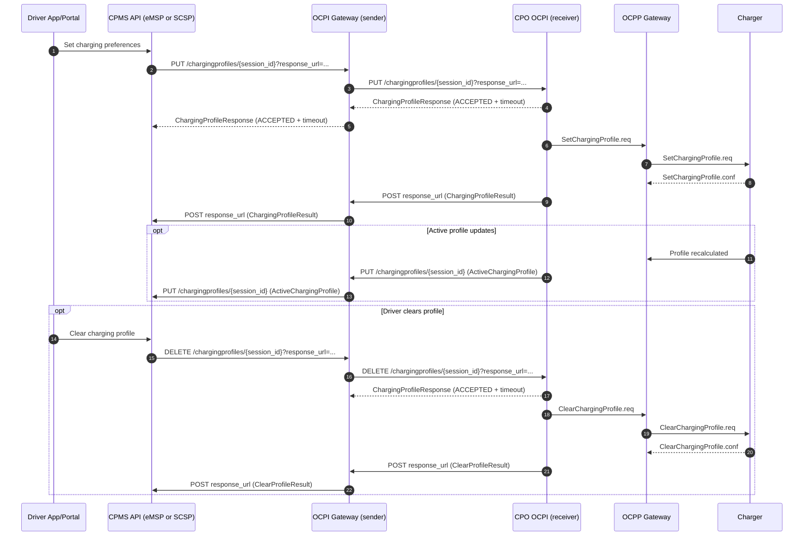

EVzone Sequence Diagrams (OCPP + OCPI + Portal)

Legend
- CPMS API: Core backend for tenants, stations, sessions, billing, and OCPI roles.
- OCPP Gateway: WebSocket server handling charger connectivity.
- OCPI Gateway: OCPI interfaces for CPO and eMSP roles.
- SSE Gateway: Real-time stream to portal and apps.

OCPP Boot + Status to Portal

Local Charging Session + CDR Push to External eMSP

Inbound OCPI Command (External eMSP -> EVzone CPO -> OCPP)

Outbound OCPI Command (EVzone eMSP -> External CPO -> OCPP)

Real-time Authorization (Token whitelist = NEVER)

Reservation + cancellation flows

Smart charging / charging profiles

